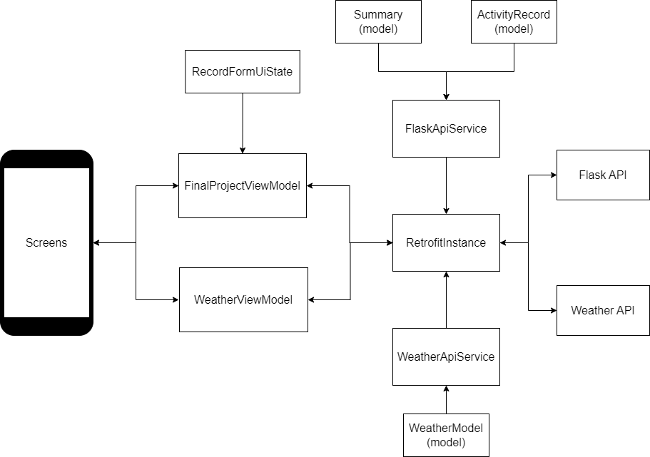

Running Tracker is a native Android app, developed with Jetpack Compose, whose purpose is to track running activities and present them to the user in a user-friendly UI.
The main idea of the app is to serve as a system that a person who practices running can use to record each of their training sessions or competitive runs. Although, theorically, it can also be used for other long-distance sports, such as cycling, swimming, triathlon or even hiking.

>This is the client side of my CS50's final project, if you wanna take a look at the server side, [click here](https://github.com/VicMarn/CS50FinalProjApi)

The app has 5 features:
1. **Create record**
2. **Delete record**
3. **Get all records**
4. **Get summary**
5. **Get weather forecast**

Each record is composed of the following data:
- **Date**
- **Time**
- **Distance**
- **Comment**

**Date** -> Date is simply the day in which the acitivity happened.

**Time** -> The amount of time it took for the user to complete the activity.

**Distance** -> The amount of space, in kilometers, the user traveled during the activity.

**Comment** -> Comment is simply a small text input the user can write to make an observation about the activity, such as "Today my performance was pretty good" or "performance was not the best today".

The system uses a client-server architecture, the Android app being the client and a REST API being the server-side.
The client side is a native Android app, which was developed using Jetpack Compose toolkit and also the third party libraries Retrofit and Coil.
The server side is a REST API developed with Flask, SQLAlchemy and SQLite for the database.
The client and server communicate through JSON.

The client-Side of the system is a native Android app developed with Jetpack Compose and the third party libraries Retrofit and Coil. The app allows the user to create a record, delete a record, see a list of all records and see a summary of the all record's data.

Let's imagine an use case scenario: A person who practices running is thinking about going outside to run some kilometers. Before they go out, they can use the app to take a look at the current weather condition for their city, which includes current temperature, humidity and precipitation, as well as the hourly forecast for the whole day. After they finish the run, they can use the app again to record some informations about it, which includes: today's date, how much time it took for them to conclude the whole run, the distance traveled and an optional comment. After creating the record, they can take a look at the whole list of records created before and their respective information, as well as a summary derived from those records, which includes: number of records, total distance traveled, total time spend running, average time spend in each run and average distance traveled in each run.

Now, let's take a look at how the app is implemented

**The image below shows the app organization:**




### MVVM

The app uses the MVVM(Model-View-ViewModel) architectural pattern, in which the ViewModel is the center, handling communication between the model and views. The ViewModel holds the state of the data that will be presented in the views. The views bind to ViewModel properties and present the data in the screen according to the current state.

### Jetpack Compose and recomposition
Jetpack Compose uses composable functions to render the UI, composable functions describe an element in the UI and undergo recomposition when a value changes. Recomposition is a proccess in which the UI element defined by the function is re-created to show the most recent state. Taking into account that the views in the app are binded to ViewModel UI State, they undergo recomposition when the State changes.

### StateFlow and MutableStateFlow
A Flow is an asynchronous data stream that sequentially emits values. StateFlow is a State holder observable flow that emits current state and state updates to collectors. MutableStateFlow is a type of StateFlow that allows State to be mutable. MutableStateFlow are used in ViewModels to hold the UI State. StateFlow are also used inside ViewModels to serve as a public read-only version of the UI State.

### FinalProjectViewModel and WeatherViewModel
This app uses two ViewModels, one called **FinalProjectViewModel** and another called **WeatherViewModel**.

**FinalProjectViewModel**

  Responsible for holding the States related to the Flask API, which contains the data about the running records. This viewModel has 3 MutableStateFlows and 3 StateFlows.

 MutableStatesFlows in FinalProjectViewModel:
- _allRecords -> Holds the list of records that comes from Flask API, through RetrofitInstance
- _summary -> Holds the summary data that comes from Flask API, through RetrofitInstance
- _formUiState -> Holds the state of the form used to create new records, which is present in AllRecordsScreen

StateFlows in FinalProjectViewModel:
- allRecords -> The public read-only version of _allRecords
- summary -> The public read-only version of _summary
- formUiState -> public The read_only version of _formUiState

The functions **createRecord**, **deleteRecord**, **fetchAllRecords** are all used by **AllRecordsScreen** to send and receive data from Flask Api. **updateOpenPostDialog**, **updateHours**, **updateMinutes**, **updateSeconds**, **updateComment**, **updateDistance**, **updateDistanceForDisplay**, **updateDate**, **upDateForDisplay** and **resetFormUiState** are all also used by **AllRecordsScreen** to update the UI State of the form used to create new records. Finally **fetchSummary** is used by **SummaryScreen** to get summary data from Flask Api.

**WeatherViewModel**

Responsible for holding States with the data that comes from Weather Api. This ViewModel has only 1 MutableStateFlow and 1 StateFlow

MutableStatesFlow in WeatherViewModel
- _weatherResponse -> Holds all the weather forecast data that comes from Weather Api, through RetrofitInstance

StateFlow in WeatherViewModel
- weatherResponse -> The public read-only version of _weatherResponse

**getForecast** is the only function inside WeatherViewModel and is responsible for getting forecast data from Weather Api, through RetrofitInstance.weatherRetrofitService. It receives an argument called "city", which is the name of the city for which the forecast is gonna be queried.


**RetrofitInstance**

Retrofit is a third party library that handles Http requests and responses. RetrofitInstance is a file where the RetrofitInstance object is defined. This object is a singleton that can be accessed thoughout the project. In this file, there are two private vals, each representing a Retrofit instance: flaskRetrofit and weatherRetrofit. As the names imply, flaskRetrofit communicates with Flask Api and weatherRetrofit communicates with Weather Api. Each instance is created using the builder pattern, getting kotlin serialization as the converterFactory and the APIs respective URLs as baseUrl.
Still in this file, two public vals are defined: retrofitService and weatherRetrofitService, they respectively get, as arguments, the FlaskApiService interface and WeatherApiService interface.

**FlaskApiService and WeatherApiService**

Both of these files hold interfaces, they each define a couple of suspend functions to handle requests and responses.
These suspend functions work asynchronously using kotlin coroutines. Each function defines the http method, the request Url and the type of response it receives, like the sample code below:

```
@GET("summary")
suspend fun getSummary() : Response<Summary>
```

FlaskApiService has four functions, **getSummary**, **getAllRecords**, **deleteRecord** and **postRecord**.

WeatherApiService has only one function **getForecast**

**getSummary** receives a response of type Summary\
**getAllRecords** receives a response of type List<ActivityRecord>\
**getForecast** receives a response of type WeatherModel\
**deleteRecord** and postRecord just receive Response<Void>\


Each of these five functions handle the http requests and responses for one of the five features the app provides:
1. **Create record**
2. **Delete record**
3. **Get all records**
4. **Get summary**
5. **Get weather forecast**


### Screens

**MainActivity**\
MainActivity is the one and only activity in this app and serves as the entry point of the application, it's only purpose is to call FinalProjectApp() composable function.

**FinalProjectScreen**\
At the top of FinalProjectScreen an Enum class called FinalProjectScreen is defined. The navigation component uses these enum entries to define the route names. There are two composable functions defined inside this file. FinalProjectAppBar() defines the top bar that appears on the top of the screen, displaying the screen name and also the upButton, which, if available, can be used to pop the backstack and go back to the previous screen. FinalProjectApp() defines the NavHost, which is a composable acting as a container for displaying the current destination, and the navController, which is responsible for navigating between screens. NavGraphBuilder.composable takes two parameters for each route: the route name (defined by the enum entries in this case) and the composable function that will be rendered in the screen of that route. FinalProjectApp() also initializes both ViewModels: FinalProjectViewModel and WeatherViewModel.

**MainMenuScreen**\
MainMenuScreen is the first sceen shown to the user when the application starts, it displays three clickable cards that navigate to AllRecordsScreen, SummaryScreen and ForecastScreen.

**AllRecordsScreen**\
AllRecordsScreen is the most complex of all screens. When the screen is launched, a LaunchedEffect coroutine is activated and calls viewModel.fetchAllRecords(). If fetchAllRecords is able to get the data successfully, a column layout will be created and two composable functions are called inside this column: PostRecordRow, which is a clickable row that can open a dialog with a form to create a new record, and RecordsLazyColumn, which is a lazy column that displays the information of each record inside of cards. If fetchAllRecords fails to get the requested data, ErrorMessage composable will be called, which is simply a column with an error message and a retry button to call fetchAllRecords again. When fetchAllRecords is called, during loading, LoadingMessage composable is called, which simply a row that display a loading message. Both ErrorMessage and LoadingMessage composable functions are defined inside ErrorAndLoadingHandling file and are called by multiple screens in the app, not only by AllRecordsScreen.

> fetchAllRecords, fetchSummary and getForecast all assign NetworkResponse objects to the values of their respective MutableStateFlows. NetworkResponse is a sealed class, defined in NetworkResponse file, with three subclasses called Success, Loading and Error. The Success subclass has a generic parameter called "data", which receives the data acquired through Http requests. Loading and Error subclasses both have String parameters for loading and error messages, respectively. NetworkResponse is used in when expressions throughout the app to decide which composable to call, depending on the response from the Http requests.

AllRecordsScreen also has two dialogs defined by composable functions: DeleteDialog and PostDialog.
DeleteDialog is triggered when the used clicks the "delete" button inside the card of a record, an AlertDialog appears on the screen and asks the user if they really want to delete that specific record.
PostDialog is triggered when the user clicks PostRecordRow, on the top of the screen. A Dialog appears on the screen, inside which there some fields that need to be filled to create a new record. The user needs to input a date, time (the time value is divided in three parts: hours, minutes, seconds), distance and comment. To input the date, the user clicks a button presented on the top-most part of the dialog, this button triggers yet another dialog, in which a calendar appears and allows the user to pick the date they want.
>There are two helpers functions, dateValidation and convertMillisToDate, that help with getting the correct inputs for date. Both of this functions are also defined inside AllRecordScreen file.

To input time, the user needs to fill three TextFields, all placed side by side in a row. The left one gets the hours value, the middle one gets minutes and the right one gets seconds. The inputs for distance and comments are simpler, the user just enter the values in the respective TextFields. The only data that is required to be filled is date, all the others, if the user doesn't enter a value, will be filled either with zero, in the case of number values, or with an empty string, in the case of comment.

**SummaryScreen**
When SummaryScreen is launched, a LaunchedEffect coroutine is activated and calls viewModel.fetchSummary(). Depending on the result of fetchSummary() and what subclass of NetworkResponse is assigned to _summary.value, three composables can be called. LoadingMessage() is called during loading, ErrorMessage is called if an error occurs and, finnaly, SummaryCard() is called in a successful case.\
SummaryCard() creates a column display with the following summary info: Number of records, total distance, average distance, total time and average time.\
To help format the time values correctly, a data class Time and a formatTime function are also defined in this file.

**ForecastScreen**
ForecastScreen is where the user can check the weather forecast for a selected city. To get the data, the user needs to input a city name in the OutlinedTextField composable and click the search icon. During loading, LoadingMessage composable is called. If an error occurs, ErrorMessage is called. If the request is successful, then WeatherDisplay is called.\
WeatherDisplay shows current weather data for the selected city and also an hourly forecast for the whole day.\
The current weather part shows the current temperature, an image that represents the current weather condition, max and min temperatures for the day, humidity and precipitation. The image is fetched and proccessed using Coil library's AsyncImage composable.\
Hourly forecast displays a LazyRow composable, which presents temperature and precipitation forecast for each specific hour and also an image representing the weather, which also uses Coil's AsyncImage.